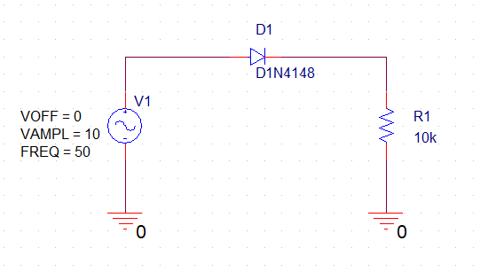
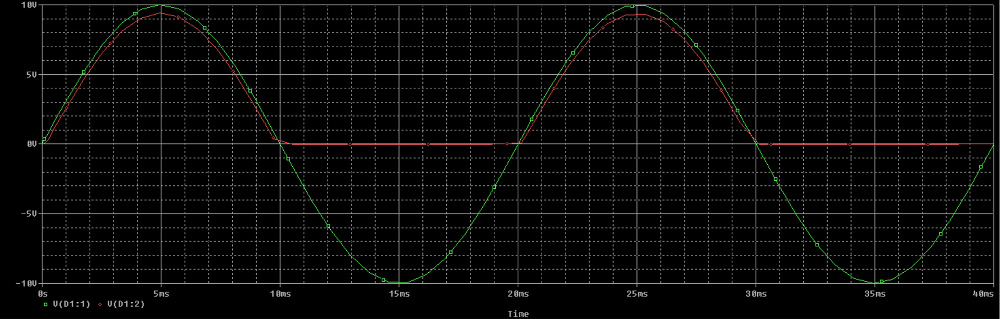
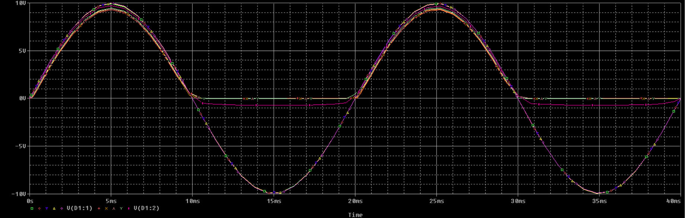
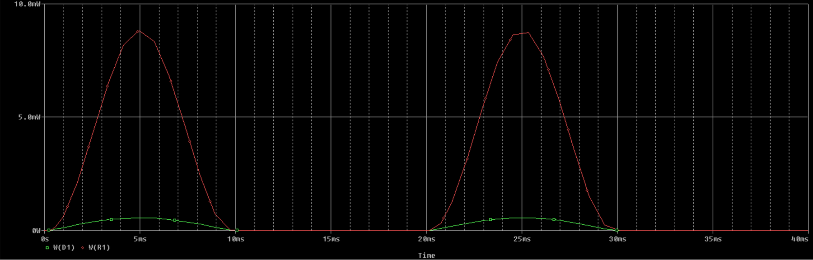
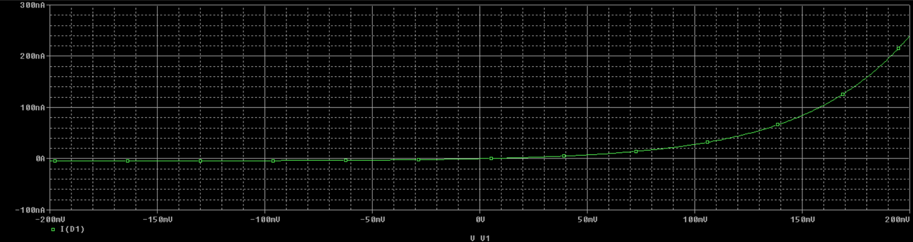

# Άσκηση 1

- Μορφακίδης Σωτήριος 
- ΑΕΜ: 10360
- msotirios@ece.auth.gr

### Το κύκλωμα

### Ερώτημα 10

Στο παρακάτω γράφημα απεικονίζεται η τάση εισόδου και εξόδου του
κυκλώματος για 2 περιόδους. Παρατηρούμε πως στα θετικά, οι γραμμές
σχεδόν ταυτίζονται, ομώς όχι και στα αρνητικά. Αυτό συμβαίνει γιατί
η δίοδος "μπλοκάρει" την αντιστροφη ροη του ρεύματος και επιτρέπει
την ροή του μόνο προς μία κατεύθυνση.

### Ερώτημα 11

Πραγματοποιώντας την ίδια προσωμοίωση σε θερμοκρασίες 
0oC,
27oC,
50oC,
100oC και
200oC,
παρατηρούμε ότι σε υψηλές θερμοκρασίες,
η καμπύλη παραμορφώνεται και πλέον η δίοδος, όταν είναι
αντίστροφα πολωμένη, διαρρέεται από μία μικρή ποσότητα
ρεύματος.

### Ερώτημα 12

Στο παρακάτω γράφημα απεικονίζεται η κυματομορφή της ισχύος
που καταναλώνει η δίοδος (πράσινο) και η αντίσταση (κόκκινο).

### Ερώτημα 13

Με τη βοήθεια της συνεχούς σάρωσης (DC Sweep) προκύπτει το
παρακάτω γράφημα, το οποίο αποτελεί την χαρακτηριστική καμπύλη
της διόδου.

