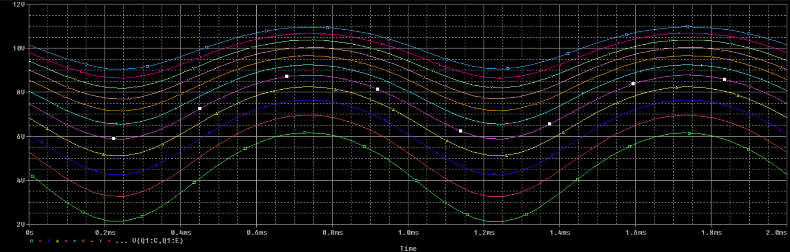
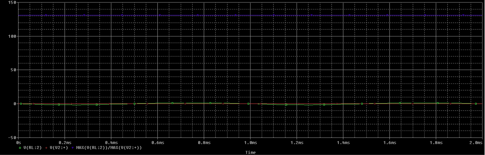
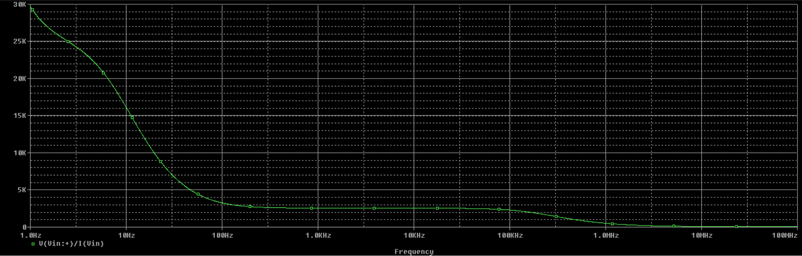
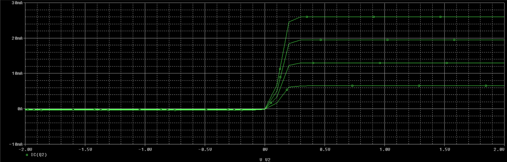

# Άσκηση 2

- Σωτήριος Μορφακίδης
- ΑΕΜ: 10360
- msotirios@auth.gr

### Ερώτημα 11

Στην παρακάτω εικόνα, κάνοντας δεξί κλικ στo trace που
αντιστοιχεί στα $7.5V$ και επιλέγωντας trace information
διαπιστώνουμε ότι η γραμμή αντιστοιχεί στα $140kΩ$.

Το ίδιο διαπιστώνουμε από το παρακάτω γράφημα, στο οποίο
φαίνεται ότι τα $7.5V$ αντιστοιχούν στα $140kΩ$.

 
\pagebreak 

### Ερώτημα 12

Παρακάτω απεικονίζονται οι κυματομορφές των τάσεων εισόδου
και εξόδου του κυκλώματος για 2 περιόδους.

### Ερώτημα 13

Αλλάζoντας την χρονική στιγμη έναρξης της προσομοίωσης απο
0s σε 100ms προκύπτει το παρακάτω γράφημα, το οποίο όμως
δεν είναι αρκετά ακριβές.

Για να γίνει σωστή απεικόνιση των κυματομορφών βάζουμε μικρότερο
step size (0.01ms) στις ρυθμίσεις της παρομοίωσης.

### Ερώτημα 14

Η ακριβής τιμή κέρδους τάσης του κυκλώματος είναι $131.7$ .

### Ερώτημα 15

Απο το γράφημα της παρακάτω προσομοίωσης διαπιστώνουμε ότι
το κύκλωμα παρουσιάζει μέγιστο κέρδος στην περιοχή συχνοτήτων
1KHz - 1MHz.

### Ερώτημα 16

Παρακάτω απεικονίζεται η αντίσταση εισόδου του κυκλώματος
συναρτήσει της συχνότητας.

### Ερώτημα 17

Παρακάτω απεικονίζεται η χαρακτηριστική καμπύλη του τρανζίστορ.

