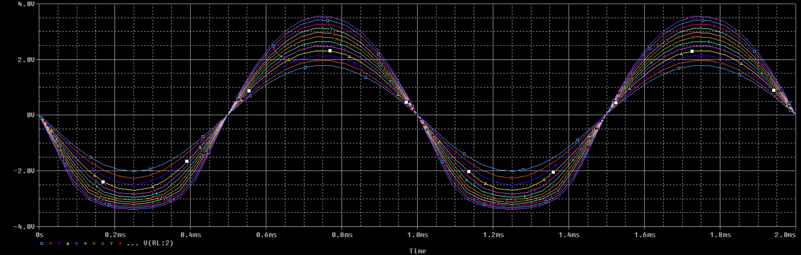

# Άσκηση 3

- Μορφακίδης Σωτήριος
- ΑΕΜ: 10360
- msotirios@ece.auth.gr

### Τα κυκλώματα

### Eρώτημα 15

Μέσω της παραμετρικής ανάλυσης, προκύπτει το παρακάτω
γράφημα. Κάθε γραμμή αντιστοιχεί σε ένα πλάτος εισόδου.
Επιλέγωντας την γραμμή με το μεγαλύτερο πλάτος, η οποία
δεν παραμορφώνεται διαπιστώνουμε ότι αντιστοιχεί στα
600mV.

### Eρώτημα 16

Παρακάτω απεικονίζονται οι κυματομορφές των τάσεων εισόδου και εξόδου
του κυκλώματος για 2 περιόδους.

### Eρώτημα 17

Αλλάζoντας την χρονική στιγμη έναρξης της προσομοίωσης απο
0s σε 100ms προκύπτει το παρακάτω γράφημα, το οποίο όμως
δεν είναι αρκετά ακριβές.

Όπως και στην άσκηση 2, για να γίνει σωστή απεικόνιση των
κυματομορφών βάζουμε μικρότερο step size (0.01ms) στις ρυθμίσεις
της παρομοίωσης.

### Eρώτημα 18

Χρησημοποιώντας την λειτουργία Trace Expressions του PSpice
προκύπτει το παρακάτω γράφημα. Έτσι διαπιστώνουμε πως η τιμή
κέρδους του κυκλώματος είναι: Αv=4

### Eρώτημα 19

Μέσω του γραφήματος απόκρισης συχνότητας του κυκλώματος
διαπιστώνουμε πως το κύκλωμα παρουσιάζει μέγιστο κέρδος
στην περιοχή συχνοτήτων 100Hz - 6MHz

### Eρώτημα 20

Παρακάτω απεικονίζεται η αντίσταση εισόδου του κυκλώματος
συναρτήσει της συχνότητας.

### Eρώτημα 21

Με τη βοήθεια της συνεχούς σάρωσης (DC Sweep) προκύπτει το
παρακάτω γράφημα, το οποίο αποτελεί την χαρακτηριστική καμπύλη
του τρανζίστορ.

