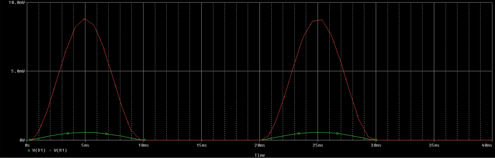
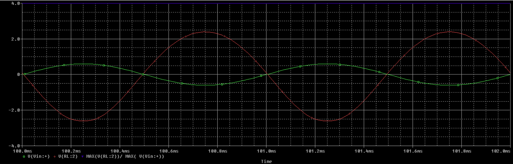

# How to spice
###### Τελευταία μορφοποίηση: 5/1/2021

### Εγκατάσταση του προγράμματος

##### Outdated: Αν δεν βαριέται κάποιος ας γράψει ένα installation guide

Μαζί με το βιβλίο του sedra-smith δίνεται ένα CD που περιέχει το
πρόγραμμα spice, ανοίγουμε το cd (άνοιγμα, όχι αυτόματη
εκτέλεση) πηγαίνουμε στο φάκελο or cad και εκτελούμε το
setup.exe, εναλλακτικά μπορείτε να κατεβάσετε το πρόγραμμα από
την ιστοσελίδα του βιβλίου.
Κατά την εγκατάσταση θα μας ρωτήσει αν θέλουμε να γίνει και η
εγκατάσταση κάποιων άλλων προγραμμάτων, βάλτε τα κι αυτά.

### Δημιουργία αρχείου

- Από τα προγράμματα που εγκαταστήσαμε ανοίγουμε το Capture ή
Capture Cis αναλόγως ποιο κάνατε εγκατάσταση.
- Επιλέγουμε File → New → Project στο Menu στη κορυφή της οθόνης.
Θα βγει ένα αναδυόμενο παράθυρο στο οποίο δίνουμε όνομα του
αρχείου, επίσης επιλέγουμε Analog or Mixed A/D.
- Στη συνέχεια επιλέγουμε Create a blank project και πατάμε OK.

### Προσθήκη βιβλιοθηκών

#####Για να προσθέσουμε τις βιβλιοθήκες:
- `Place` → `Part` → `Add library to path` 
- `Program Files` → `OrCad Lite` (ή `OrCad`) → `Capture` → `Library` → `Pspice`
- Επιλέγουμε όλες τις βιβλιοθήκες (`Control A`) και τις ανοίγουμε.

Για τις γειώσεις όμοια: 
- `Place` → `Ground` → `Add library` και επιλέγουμε τη
βιβλιοθήκη `SOURCE` και την προσθέτουμε.

# Άσκηση 1

### Ερώτημα 10

#### Δημιουργία του κυκλώματος

##### Για να δημιουργήσουμε το κύκλωμα:

- Place → Part, επιλέγουμε όλες τις βιβλιοθήκες (Control+A ή Shift+A)
και πληκτρολογούμε το όνομα του part που θέλουμε να βάλουμε.
- Για τη δίοδο:
	* Πληκτρολογούμε d1n4148
	* Πατάμε OK ή Enter
	* Την τοποθετούμε στο σχήμα
- Τips για ευκολότερη χρήση:
	* Το πλήκτρο Esc αναιρεί την επιλογή (ξε-επιλέγει)
	* Κάνωντας drag με το αριστερό κλικ επιλέγουμε ένα η περισσότερα Parts
	* Με το R (Rotate) περιστρέφουμε ένα επιλεγμένο Part
	* Με το W (Wire) επιλέγουμε καλώδια
	* Με το G (Ground) ανοίγει το παράθυρο για το Ground
- Για την αντίσταση R1:
	* Place → Part
	* Πληκτρολογούμε R
	* Επιλέγουμε την R/ANALOG 
	* Την τοποθετούμε στο σχήμα. 
	* Αν θέλουμε να αλλάξουμε το όνομα η την τιμή της
πατάμε διπλό κλικ στο όνομα η την τιμή και το αλλάζουμε.
- Για την πηγη:
	* Place → Part πληκτρολογούμε VSIN γιατί θέλουμε μια
ημιτονοειδή πηγή
	* Την τοποθετούμε στο σχήμα και πάλι με διπλό κλικ
	* δίνουμε τις επιθυμητές τιμές.
- Για τις γειώσεις:
	* Place → Ground 
	* Επιλεγουμε την γείωση 0 (αλλιώς θα έχουμε floating nodes error)
	* Την τοποθετούμε στο κύκλωμα
- Τέλος συνδέουμε τα πάντα με καλώδια Place → Wire.


#### Δημιουργία προσομοίωσης

#####Για να δημιουργήσουμε μία προσομοίωση:

- Επιλέγουμε από την τρίτη μπάρα new simulation profile δίνουμε
ένα όνομα (inherit: none).
- Βγαίνει ένα αναδυόμενο παράθυρο με
τις ρυθμίσεις τις προσομοίωσησ, το οποίο μπορούμε να το
ανοίγουμε οπότε θέλουμε με την επιλογή edit simulation settings.
- Για την άσκηση πηγαίνουμε στην καρτέλα analysis.
- Επιλέγουμε το time domain (transient).
- Από τα general settings θέτουμε το run to time χρόνο 2 περιόδων.
Η συχνότητα είναι 50Hz άρα η μια περίοδος
θα είναι 20ms (παράρτημα για μονάδες μετρήσεισ)
- Πατάμε OK
- Πάμε πίσω στο σχήμα μας και τοποθετούμε 2 markers τάσης
έναν για τη είσοδο(αμέσως μετά την πηγή) και έναν για την
έξοδο (πριν την αντίσταση)

##### Για να τρέξουμε την προσομοίωση:

- Πατάμε το κουμπί run simulation και θα
μας ανοίξει το spice με το σχήμα μας.


##### Για να αποθηκεύσουμε το σχήμα:

- Επιλέγουμε από το μενού στη
κορυφή τις οθόνης window → copy to clipboard και κάνουμε
επικόλληση είτε κατευθείαν στο αρχείο κείμενου μας είτε σε ένα
αρχείο ζωγραφικής για να το κάνουμε εικόνα.


### Ερώτημα 11

- Κάνουμε Edit Simulation
- Βάζουμε check στο temperature sweep → repeat for each temperature
- Γράφουμε τις θερμοκρασίες που μας ζητάει χωρισμένες με κενά π.χ. 0 27 50 100 200.
- Πατάμε εκ και τρέχουμε τη προσομοίωση.

Θα πάρουμε ένα σχήμα με γραφικές παραστάσεις για κάθε θερμοκρασία.


### Ερώτημα 12

- Με τις ρυθμίσεις του ερωτήματος 10 τρέχουμε την προσομοίωση 
άπλα αντί για markers τάσης χρησιμοποιούμε ένα marker μέτρησης
ισχύος (τον τοποθετούμε πάνω στο αντικείμενο που θέλουμε να
μετρήσουμε) για να μετρήσουμε την ισχύ που καταναλώνεται στην
r1. (DC SWEEP – Εύρεση χαρακτηριστικήσ)



### Ερώτημα 13

- Φτιάχνουμε το κύκλωμα του σχήματος
- Βάζουμε ένα marker ρεύματος στο πάνω άκρο τις διόδου
- Πάμε στο Edit Simulation Settings → Analysis Type → DC SWEEP
- Πάμε στο variable sweep και βάζουμε voltage source, name to όνομα τις πηγήσ(V1),
linear, 
- Θέτουμε Start value (π.χ. -200mV), End value (π.χ. +200mV)
και Increment (βήμα 1mV)
- Πατάμε OK και τρέχουμε την προσομοίωση.

Το σχήμα που θα προκύψει είναι η χαρακτηριστική τις διόδου.


# Άσκηση 2

### Δημιουργία μοντέλων τρανζίστορ και βιβλιοθηκών

Αρχικά πρέπει να δημιουργήσουμε το μοντέλο του τρανζίστορ
και μια δίκια μας βιβλιοθήκη.
- Ανοίγουμε ένα text αρχείο και βάζουμε τις πληροφορίες του
μοντέλου:

``` js
.model bc238 npn (bf=130 rb=50 cje=13e-12 cjc=4e-12 vje=0.7)
```
- Το αποθηκεύουμε ως BC238.mod ή ως BC238.obl.
- Ανοίγουμε το πρόγραμμα Pspice Model Editor (Pspice A/D)
- Από το μενού: `File` → `New`, 
- Από το μενού: `Model` → `Import...` και κάνουμε 
browsing μέχρι να βρούμε το αρχείο που δημιουργήσαμε.
- Το επιλέγουμε και πατάμε `Open`
- Από το μενού: `File` → `Save As...`
- Αποθηκεύουμε το αρχείο ως MYLIBRARY.lib.
- Από το μενού: `File` → `Export to Capture Part Libray...`, εκεί που λέει enter input
model library, επιλέγουμε browse και βρίσκουμε τη MYLIBRARY.lib
πατάμε OK.

Τελειώσαμε με την δημιουργία της βιβλιοθήκης. Tώρα μπορούμε να
την βάλουμε στο project μας. Όνομα της βιβλιοθήκης είναι MYLIBRARY.olb

- Προαιρετικό για να δούμε αν η βιβλιοθήκη μας είναι εντάξει:
	- Ανοίγουμε το capture
	- File → Open → Library
	- Βρίσκουμε το αρχείο που φτιάξαμε πριν, στη συνέχεια έχει 
επιλογές για την επεξεργασία του σχήματος του νέου αντικείμενου,
οι οποίες δεν είναι απαραίτητες.
- Για να τοποθετήσουμε το αντικείμενο στο
κύκλωμα πρέπει να κάνουμε Add library → MYLIBRARY.lib

### Ερώτημα 11

##### Σχηματίζουμε το κύκλωμα

Το {r} στην re σημαίνει ότι η r1 είναι
παραμετρική. Για αυτό πρέπει να την προσθέσουμε ως παράμετρο.

##### Για να προσθέσουμε την παράμετρο:

- `Place` → `Part` → `PARAM/SPECIAL`
- Βάζουμε το αντικείμενο πάνω στο σχήμα
- Πατάμε διπλό κλικ επιλέγουμε `New Property`
- Στο `Name` βάζουμε το όνομα τις παραμέτρου δηλαδή r και
στο `Value` κάτι τυχαίο (π.χ. 4)
- Πατάμε `OK`
- Προαιρετικό:
	- Πατώντας `Pivot` μπορούμε να δούμε τον πίνακα κατακόρυφα αντί
για οριζόντια και έτσι είναι πιο ευανάγνωστος
- Κάνουμε κλικ πάνω στη στήλη που δημιουργήσαμε
- Μέτα πηγαίνουμε στο `display`, επιλέγουμε `name and
value`, πατάμε `OK`. 
- Πατάμε `Apply` και μετά `Save`, πάμε πίσω στο
κύκλωμα από το μενού `window` → `schematic`. 

Θα πρέπει να εμφανίζονται στο αντικείμενο parameters από κάτω
το όνομα και η τιμή τις παραμέτρου (π.χ. `r = 4`).
Edit: σε περίπτωση που δεν εμφανίζεται το όνομα τις παραμέτρου
επαναλάβετε τη διαδικασία, άπλα στο `Display` επιλέξτε `Both if value
exists`.

##### Τώρα θα κάνουμε την παραμετρική ανάλυση.

Για την προσομοίωση επιλέγουμε:
- `Analysis type` → `Time Domain (Transient)` 
- Επιλέγουμε `Parametric Sweep`
- `Global Parameter`, `Parameter name = r`, 
- `Sweep type` → `linear`
- Συμπληρώνουμε: 
	- `Start value` (π.χ. `100k`), 
	- `End value` (π.χ. `200k`),
	- `Increment` (π.χ. `10k`)
- Πατάμε apply και πηγαίνουμε στο library, πατάμε
browse και βρίσκουμε τη βιβλιοθήκη που φτιάξαμε την κάνουμε add
as global. OK.
- Τα δεδομένα λένε ότι θέλουμε την R1 για την οποία 
$$$
Vce = Vcc / 2 = 15 / 2 = 7.5V 
$$$

Για να βλέπουμε την Vce τοποθετούμε τα +/- markers:
- το "+" πάνω από τον συλλέκτη του τρανζίστορ
- το "–" στον εκπομπή του τρανζίστορ.
- Run simulation.

Θα εμφανιστούν πολλές γραμμές:
- Επιλέγουμε αυτή που είναι πιο κοντά στα 7.5V
- Δεξί κλικ → `Trace Information`

Σημείωση: για το Vcc: `Place` → `Off page connector`.


##### Προαιρετικό: Εναλλακτική λύση

Το μόνο που αλλάζει είναι το Simulation Profile στο οποίο επιλέγουμε:
- `Analysis type` → `DC Sweep` 
- Επιλέγουμε `Primary Sweep`
- Συμπληρώνουμε: `Voltage Source` → `V1` (Η όπως έχουμε ονομάσει την DC πηγή)
- `Global Parameter` →`Parameter name: r`
- `Sweep type` → `Linear`
- Συμπληρώνουμε: 
	- `Start value` (π.χ. `100k`), 
	- `End value` (π.χ. `200k`),
	- `Increment` (π.χ. `10k`)

Προκύπτει το παρακάτω γράφημα, στο οποίο φαίνεται πιο εύκολα η αντιστοιχία


### Ερώτημα 12 

Πρόκειται για ένα απλό simulation όμοιο με αυτό της
άσκησης 1, άπλα για να αναγνωρίσει το τρανζίστορ πρέπει
να γίνει η εξής ρύθμιση: 
- Πηγαίνουμε στο `Library`
- Πατάμε `Browse`
- Βρίσκουμε τη βιβλιοθήκη που φτιάξαμε
την κάνουμε `Add as global`.


### Ερώτημα 13

#### Προσομοίωση μετά από κάποιο χρονικό διάστημα:

- Κάνουμε πάλι μια transient ανάλυση με τις έξης ρυθμίσεις: 
	- `Run to time` → `102ms`
	- `Start saving data` → `100ms` 
- Η κυματομορφή που θα προκύψει δεν θα είναι ομαλή. 
Για να διορθωθεί αυτό βάζουμε ένα
μικρο `Maximum step size` (π.χ. `0.01ms`) και θα πάρουμε μια πολύ
καλύτερη καμπύλη.


### Ερώτημα 14

#### Χρήση των Trace expressions

Το κέρδος τάσης βγαίνει από τον έξης τύπο: 
$$$
Av = Vout(max) / Vin(max)
$$$

Πηγαίνουμε στο σχήμα της προσομοίωσης επιλέγουμε από το Menu:
- `Trace` → `Add Trace` και φτιάχνουμε χρησιμοποιώντας τους 2 πίνακες
που έχει στο αναδυόμενο παράθυρο το Trace expression:
`MAX(V(RL:2))/MAX(V(Vin:+))`

Θα προκύψει μια ευθεία γραμμή που θα είναι το κέρδος τάσης.


### Ερώτημα 15

#### AC Sweep:
- Αλλάζουμε την πηγή από VSIN σε VAC
- Φτιάχνουμε μια προσομοίωση με τις έξης ρυθμίσεις:
	- `Analysis Type` → `AC Sweep`
	- `AC Sweep Type` → `Logarithmic (decade)`
	- `Start freq`(π.χ. 1) , `End freq` (π.χ. 100meg), `Points/decade` (π.χ. 500).
- Τρέχουμε το simulation
- Προσθέτουμε το `Trace expression: DB(V(RL:2)/V(V2:+))`
(θεωρία σελίδα 21 φυλλάδιο εργαστηρίου)

Από τη γραφική παράσταση που θα προκύψει βλέπουμε από ποιες
μέχρι ποιες συχνότητες έχουμε μέγιστο κέρδος και ποιο είναι
αυτό(κάνουμε zoom για να το βρούμε).
(cheat: συχνότητες 1KHz – 1MHz, Αv=43)


### Ερώτημα 16

Είναι η ίδια διαδικασία με το 15, άπλα θα έχουμε το trace expression
για την αντίσταση εισόδου, η οποία είναι:

$$$
Rin = Vin / Iin
$$$

Συνεπώς στο trace expression θα έχουμε: `V(Vin:+)/I(Vin)`.


### Ερώτημα 17

#### DC Sweep με 2 πηγές

- Φτιάχνουμε το κύκλωμα
- Τοποθετούμε ένα Marker ρεύματος πάνω από τον συλλέκτη

##### Για την προσομοίωση:
- Επιλέγουμε: `Analysis Type` → `DC Sweep`
- Στο `Primary Sweep`:
	- Επιλέγουμε `Voltage Source` → `Name` → `V1`
	- Για την πηγή τάσης δίνουμε τιμές:
		- `Start Value` (π.χ. `-2V`),
		- `End Value` (π.χ. `+2V`),
		- `Increment` (π.χ. `0.1V`)
- Επιλέγουμε το Secondary Sweep:
	- Συμπληρώνουμε `Current Source → Name → I1`
	- Για την πηγή ρεύματος δίνουμε κάποιες ενδεικτικές τιμές
ρεύματος βάσης μέσω της επιλογής `Value List` της τάξης μερικών
μικροαμπέρ (π.χ. `50uA 100uA 150uA 200uA`)
- Run simulation

Θα προκύψει η χαρακτηριστική καμπύλη της διόδου.


# Άσκηση 3

### Eρώτημα 15

Η δημιουργία του μοντέλου του τρανζίστορ γίνεται όπως στην άσκηση
2, το ίδιο και η παραμετρική ανάλυση (προτεινομενες τιμες: 550mV
μέχρι 650mV με βήμα 10mV)

- `V = 600mV`


### Eρώτημα 16

Ακριβώς όπως στην άσκηση 2.


### Eρώτημα 17

Ακριβώς όπως στην άσκηση 2.


### Eρώτημα 18

Ακριβώς όπως στην άσκηση 2.
- `Av = 5`



### Eρώτημα 19

Ακριβώς όπως στην άσκηση 2.
- Περιοχή συχνοτήτων: `90Hz - 7MHz`
- `Av = 12.5`


### Eρώτημα 20

Ακριβώς όπως στην άσκηση 2.


### Eρώτημα 21

DC Sweep όπως στηv άσκηση 2,
- `Primary Sweep` → V2 με τιμές 0V έως 10V και βήμα 1V
- `Secondary sweep` → V1 με τιμές 0 έως 0.8V με βήμα 0.2V 
- Ο Marker (έντασης ρεύματος) μπαίνει στην εκροή (D).


#### Υποσημείωση

Αυτό το αρχείο είναι βασισμένο σε υλικό από το αρχείο
[How to Spice](https://www.thmmy.gr/smf/index.php?action=tpmod;dl=item2301) του dimkirt, Exomag και Batman

`https://www.thmmy.gr/smf/index.php?action=tpmod;dl=item2301`

Εγώ μετέτρεψα το αρχείο σε Markdown format και το εμπλούτισα
σε ορισμένα σημεία που έιχε ελλείψεις. Το αρχείο υπάρχει στο
[Github](https://github.com/sotirismorf/how_to_spice)
και στο [THMMY](https://www.thmmy.gr/smf/index.php?action=tpmod;dl=cat40).

`https://www.github.com/sotirismorf/how_to_spice`

Αν βρεις κάποιο κλάθος η αν πιστεύεις πως κάτι θα μπορούσε να είναι γραμμένο καλύτερα, άνοιξε ένα issue στο Github η στείλε μου ένα μήνυμα.

\- sotirismorf
